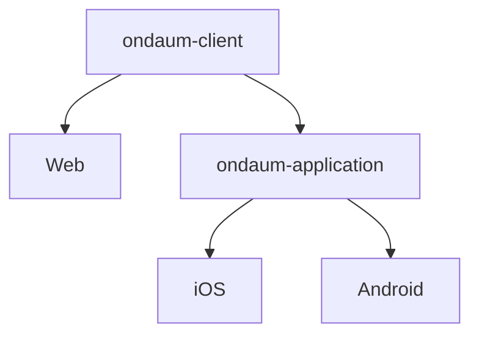

# Ondaum client - Web App
> Hello👋 This is team Ondaum. ***Ondaum*** is a pure Korean word, meaning ***'a warm and genuine self'***.


## 🌍 OVERVIEW
We want to help people around the world live healthier lives by being with Um, an AI professional psychological counseling companion, anytime and anywhere.

In the past year, 73.6% of Korean young adults experienced mental health challenges. In addition, global statistics reveal that 66% of individuals aged 18-24 report experiencing moderate to severe.

Ondaum provides accessible, mental health support anytime, anywhere, reducing financial and stigma barriers.
The chatbot analyzes conversations in real time to detect risk signals and offer timely support, while its friendly interface keeps users engaged and lowers resistance.


Let's start https://ondaum.revimal.me/

#### 📱 FEATURES
- AI Counseling With Um
  - Personalized Psychological Assessments & Real-Time Crisis Response
- Psychological Assessments
  - International standard tests(PHQ-9 / GAD-7 / PSS)
  - Deliver tailored insights and links to support upon risk detection
- AI Analysis of Conversation Content
  - Summary and organization of the conversation
  - extracting key emotions and keywords
  - visualize the recommends using charts

#### ✨ VALUES
- Available for consultation anytime, anywhere
- Personalized consultation possible
- Reduced barriers to seeking counseling
- Access to a pre-trained professional psychological counseling AI

## 🛠 SKILLS
- **Web**: React, Typescript, Zustand, WebSocket, TailwindCSS
- **Mobile**: Flutter, Dart
- **AI**: Gemini-2.5-Pro
- **Auth**: Google Oauth, jwt
- **Bundler**: Vite, 
- **Package Manager**: NPM
- **Logging System**: Google Analytics

## 🏛️ CLIENT ARCHITECTURE

  
## 📁 DIRECTORY
```
src/
├── api/           # server API list
│   ├── auth
│   ├── chat
│   ├── onboarding
│   ├── report
│   └── test
├── assets/        # static assets
│   ├── images
│   └── lotties    
├── commons/       # common components (like metaial UI)
│   ├── data-display
│   ├── feedback
│   ├── inputs
│   ├── mui-x/DatePickers
│   ├── navigation
│   └── surfaces
├── hooks/         # custom hooks
├── services/      # service components
│   ├── auth
│   ├── error
│   ├── home
│   ├── onboarding
│   ├── report
│   └── setting
├── styles/        # reset css
├── store/         # zustand store
│   ├── auth
│   ├── chat
│   ├── keyboard
│   └── onboarding
```

## 🚀 INSTALLATION

1. Set Node LTS Version (As of May 15, 2025)
```bash
node -v v 22.15.0
nvm install 22
nvm use 22
```

3. Install packages
```bash
npm install
```

3. Run dev mode
```bash
npm run dev
```

## 🖥️ SCREENS

| |
|:--:|
|  | 
 |  | 
 |  | 
 |  | 


📅 This README was written on **May 15, 2025**.
